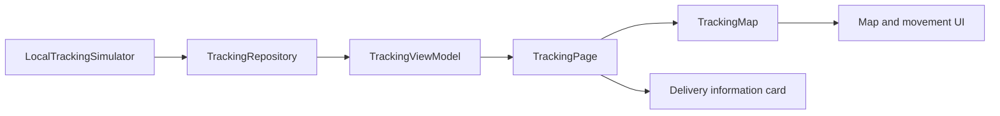

# Rider Tracking

Rider Tracking is a Flutter delivery-tracking demonstration app. It shows how a customer-facing tracking experience can be built around a realtime state stream, beginning with a deterministic local rider simulator before introducing a remote backend.

The current experience follows **Dobz**, a friendly rider, as she moves along a predefined route. The app renders the route on a map, smoothly moves the rider marker between updates, follows the rider when enabled, and presents delivery status, ETA, remaining distance, rider information, and progress.

This project intentionally uses local data today. It does not yet connect to WebSockets, a Go backend, device geolocation, or a real routing service.

## Current Progress

The following development phases are complete:

1. **Foundation**: app shell, routing, theme, domain models, repository contract, Provider wiring, and initial ViewModel.
2. **Local rider simulation**: deterministic route progression, distance, ETA, status transitions, timestamps, and stream completion.
3. **Map rendering**: route polyline, origin and destination markers, and the current rider marker.
4. **Live rider movement UX**: smooth marker interpolation, camera follow, manual follow cancellation, and recenter behavior.
5. **Tracking experience UI**: polished delivery status, Dobz rider identity, human-friendly metrics, and delivery progress.

## Architecture

The app uses a feature-first Flutter structure. Tracking-specific code lives under `lib/features/tracking/`, while app composition and routing live under `lib/app/`.



The `TrackingRepository` contract keeps the presentation layer independent from the source of tracking data. The ViewModel subscribes to that contract and exposes the latest immutable presentation state. The page renders that state, while the map owns visual marker interpolation and camera behavior.

The simulator can later be replaced or supplemented by a WebSocket-backed data source through repository wiring without rewriting the tracking screen.

## Tech Stack

- Flutter and Dart
- Material 3 theming
- `provider` for dependency injection and ViewModel access
- `ChangeNotifier` for presentation state
- `go_router` for declarative routing
- `flutter_map` for map rendering
- `latlong2` for map coordinate values
- OpenStreetMap public tiles for the current demonstration map
- Flutter widget tests and deterministic simulator tests

## Learning Approach

The project is built in small, completed vertical phases. Each phase establishes one useful piece of the product, keeps data and presentation boundaries explicit, adds focused tests, and records the important decisions in a short learning note.

See [`docs/learning/`](docs/learning/) for the phase-by-phase notes, diagrams, architectural decisions, deferred work, and key lessons. [`docs/learning/00-project-overview.md`](docs/learning/00-project-overview.md) provides the overall project map.

## Project Goals

- Build a clear customer-facing delivery-tracking experience.
- Demonstrate a stable stream boundary between data sources and UI.
- Keep simulation, repository, ViewModel, page, and map responsibilities separated.
- Make realtime state flow easy to test with deterministic inputs.
- Prepare the presentation layer for a future remote tracking source.
- Use each phase to strengthen practical Flutter and software architecture skills.

## Running Locally

Install Flutter, then run:

```sh
flutter pub get
flutter run
```

Run the test suite with:

```sh
flutter test
```

The app opens at `/tracking`. The local simulator advances automatically and eventually reaches the `Delivered` state.

## Screenshots

Screenshots and demo media will be added here when the UI and visual direction are finalized.

## Current Status

The local tracking experience is functional and suitable for demonstrating the current product direction. The simulator, map, movement UX, delivery information panel, and focused tests are in place.

The next planned milestone is a new tracking data source behind the existing `TrackingRepository` contract. Production concerns such as authentication, connection recovery, persistence, device location, backend integration, routing, notifications, and production tile configuration remain intentionally unimplemented.
