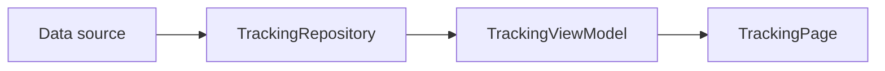

# Project Overview

## Purpose

Rider Tracking is a Flutter app for customers waiting for a delivery. It is being built toward a live view of a rider, the delivery route, the estimated arrival time, and the delivery status.

The current app uses a local rider simulation. This makes the user experience and data flow testable before a real backend exists.

## Architecture

The project uses a feature-first structure. Code for tracking stays under `lib/features/tracking/`. App-wide wiring belongs in `lib/app/`, while genuinely shared helpers belong in `lib/core/`.

The tracking flow is:

The default data source is `LocalTrackingSimulator`. A WebSocket data source now provides the same kind of tracking snapshots behind a second repository implementation. The repository contract and ViewModel stream remain stable, so the UI does not need to know which source is active.

## Development progress

1. Foundation: complete. The app shell, routing, theme, domain models, repository contract, Provider wiring, and initial ViewModel exist.
2. Local rider simulation: complete. A deterministic route emits snapshots, and the page displays live tracking values.
3. Map tracking: complete. The page renders the route, rider position, and destination on a map.
4. Live rider movement UX: complete. Marker movement is interpolated and the map can follow or recenter on the rider.
5. Tracking experience UI: complete. The map now has a polished delivery status, rider identity, ETA, distance, and progress panel.
6. Phase 6A WebSocket contract and Go server: complete. A separate Go simulator emits deterministic tracking JSON over `/ws/tracking`; Flutter integration remains deferred.
7. Phase 6B Flutter WebSocket source: complete. A strict WebSocket DTO, transport data source, and repository implementation now coexist with the local source; local wiring remains the default.
8. Phase 6C runtime source selection: complete. Compile-time configuration can select the local simulator or Go WebSocket repository at the app composition root; local remains the default.
9. Phase 7 resilience and product hardening: later. Add stale-message handling, reconnects, authentication, persistence, platform location concerns, and production observability.

## Important boundary

The current page is still intentionally simple. It proves that updates reach a map and status overlay, but it is not yet the final customer tracking experience.

## Files to know

- `lib/app/app.dart` creates the repository and ViewModel and starts the app.
- `lib/app/tracking_source_config.dart` parses compile-time source configuration.
- `lib/app/tracking_composition.dart` selects the repository implementation.
- `lib/app/router.dart` maps the tracking route to the tracking page.
- `lib/features/tracking/domain/repositories/tracking_repository.dart` defines the source-independent tracking stream.
- `lib/features/tracking/data/datasources/local_tracking_simulator.dart` creates local tracking snapshots.
- `lib/features/tracking/data/repositories/local_tracking_repository.dart` exposes the simulator through the domain contract.
- `lib/features/tracking/presentation/view_models/tracking_view_model.dart` turns stream events into immutable presentation state.
- `lib/features/tracking/presentation/pages/tracking_page.dart` renders the map and current tracking state.

## Remember

The key design choice is the stable stream boundary. A source publishes tracking snapshots, the repository exposes them, the ViewModel owns subscription state, and the page renders state. Future transport changes should stay below that boundary.
