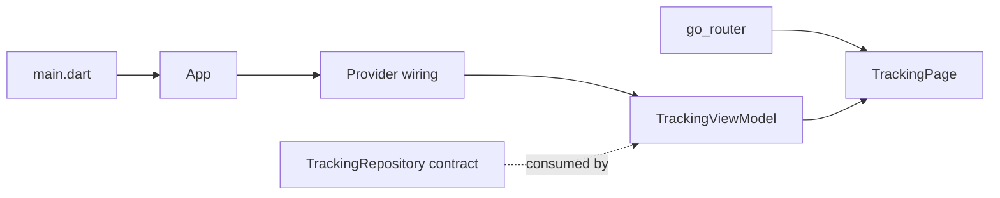

# Foundation

## What we built

The first phase replaced the default counter app with a small tracking app shell. It established:

- a Material 3 light and dark theme;
- declarative routing to `/tracking`;
- tracking domain models for coordinates, status, and snapshots;
- a `TrackingRepository` stream contract;
- Provider wiring for the repository and ViewModel;
- a `TrackingViewModel` with an initial presentation-state shape.

## Why it exists

These pieces create a place for the first feature slice without committing the UI to a particular data source. The app can grow from a simple local stream to a remote realtime stream while keeping feature boundaries clear.

The communication path is:

## Major pieces

`App` in `lib/app/app.dart` is the composition root. It creates the repository implementation and passes it to `TrackingViewModel` through Provider. This keeps construction out of the page.

`appRouter` in `lib/app/router.dart` gives the app a stable `/tracking` entry point and keeps navigation configuration out of feature widgets.

`AppTheme` in `lib/app/theme/app_theme.dart` centralizes the initial visual language and supports both system light and dark modes.

`GeoCoordinate`, `TrackingStatus`, and `TrackingSnapshot` in `lib/features/tracking/domain/models/` describe tracking information without Flutter widgets, networking, or simulator details.

`TrackingRepository` in `lib/features/tracking/domain/repositories/tracking_repository.dart` exposes `watchTracking()`. The ViewModel depends on this contract rather than on a concrete simulator or future WebSocket client.

`TrackingViewModel` in `lib/features/tracking/presentation/view_models/tracking_view_model.dart` is a `ChangeNotifier`. It will own the subscription and expose state for the page. It does not decide how tracking data is produced.

## Architectural decisions

Provider and `ChangeNotifier` are sufficient for this first vertical slice. Provider supplies dependencies and widget access; `ChangeNotifier` gives the page a simple way to rebuild when the latest snapshot changes. Adding a larger state-management system would add cost before the product needs it.

The feature-first layout keeps tracking-specific code together. There are no global data or domain layers. Shared code should only move into `lib/core/` when more than one feature genuinely needs it.

## Deliberately left for later

This phase does not include map rendering, location permissions, a network client, WebSockets, authentication, persistence, or production error handling. The initial page and data source were added in the next phase.

## Files to know

- `lib/main.dart` starts the Flutter app.
- `lib/app/app.dart` composes the app and dependency providers.
- `lib/app/router.dart` defines the route entry point.
- `lib/app/theme/app_theme.dart` defines the app theme.
- `lib/features/tracking/domain/models/geo_coordinate.dart` defines latitude and longitude values.
- `lib/features/tracking/domain/models/tracking_status.dart` defines delivery states and labels.
- `lib/features/tracking/domain/models/tracking_snapshot.dart` defines one tracking update.
- `lib/features/tracking/domain/repositories/tracking_repository.dart` defines the repository boundary.
- `lib/features/tracking/presentation/view_models/tracking_view_model.dart` defines presentation state and subscription ownership.
- `lib/features/tracking/presentation/pages/tracking_page.dart` is the tracking screen entry point.

## Remember

The foundation separates what tracking data means from where it comes from and how it is displayed. That separation is the main reason the later simulator and WebSocket work can share the same UI-facing contract.
