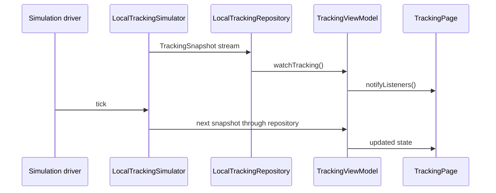

# Local Rider Simulation

## What we built

The second phase added a local rider that moves along a fixed route. It emits `TrackingSnapshot` values containing:

- rider position;
- delivery status;
- remaining distance;
- ETA;
- destination;
- a deterministic timestamp.

The stream completes when the rider reaches the destination. The page displays these values in a status overlay and uses the location for map rendering.

## Why use a fake rider first

A simulator lets us prove the realtime state flow before a backend, map provider, authentication system, or live location service exists. It also gives tests a known route and known outcomes instead of depending on a network or a moving real device.

## How the pieces communicate

`LocalTrackingSimulator` in `lib/features/tracking/data/datasources/local_tracking_simulator.dart` owns the route, interpolation, distance calculation, ETA, status transitions, timestamps, and stream completion.

`TrackingSimulationDriver` in `lib/features/tracking/data/datasources/tracking_simulation_driver.dart` supplies ticks. `PeriodicTrackingSimulationDriver` uses a real timer for the running app. `ManualTrackingSimulationDriver` lets tests advance the simulation explicitly.

`LocalTrackingRepository` in `lib/features/tracking/data/repositories/local_tracking_repository.dart` constructs the simulator and exposes its snapshots through `TrackingRepository`. The ViewModel does not know that the source is simulated.

`TrackingViewModel` subscribes to the repository stream, stores the latest snapshot as `TrackingViewState`, marks loading and completion, and cancels its subscription when disposed.

`TrackingPage` in `lib/features/tracking/presentation/pages/tracking_page.dart` listens to the ViewModel and displays the current map and tracking values. It contains no route progression logic.

## Deterministic timing

The simulator advances by a fixed distance on each tick: speed multiplied by the tick interval. Its clock starts at a fixed UTC value unless configured otherwise. Therefore the same route and tick sequence produce the same snapshots.

Tests use `ManualTrackingSimulationDriver` and call `advance()` instead of waiting for real time. This makes the tests fast and avoids flaky timing caused by operating-system scheduling.

## Architectural decisions

Simulation concerns stay in the data layer. The ViewModel only consumes the repository contract, which keeps the presentation layer reusable.

The driver is injected so the production app can run periodically while tests control each event. The simulator also owns cleanup: cancelling the stream cancels the driver, and reaching the destination closes the stream cleanly.

## Deliberately left for later

There is no real GPS input, WebSocket, reconnect policy, or server-authoritative ETA. The route remains predefined and local.

## Files to know

- `lib/features/tracking/data/datasources/local_tracking_simulator.dart` contains route progression and snapshot production.
- `lib/features/tracking/data/datasources/tracking_simulation_driver.dart` separates tick production from simulation logic.
- `lib/features/tracking/data/repositories/local_tracking_repository.dart` adapts the simulator to the repository contract.
- `lib/features/tracking/domain/models/tracking_snapshot.dart` carries one complete update.
- `lib/features/tracking/presentation/view_models/tracking_view_model.dart` consumes updates and owns subscription cleanup.
- `lib/features/tracking/presentation/pages/tracking_page.dart` renders the temporary diagnostic UI.
- `test/features/tracking/data/local_tracking_simulator_test.dart` checks movement, distance, ETA, completion, and ordering.
- `test/features/tracking/presentation/view_models/tracking_view_model_test.dart` checks state updates and subscription cleanup.

## Remember

The simulator is replaceable because time and data production are behind interfaces. A future WebSocket source can publish server snapshots through a repository implementation while the ViewModel and page continue to consume tracking state in the same way.
