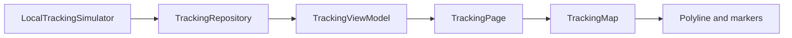

# Map Rendering

## What this phase adds

The tracking page now shows a map with the predefined route as a polyline, origin and destination markers, and a rider marker. The status, ETA, remaining distance, and coordinate diagnostics remain in a small overlay.

## How state reaches the map

The simulator still owns time, interpolation, distance, ETA, and status. The repository exposes the same stream, and the ViewModel stores the latest snapshot as `TrackingViewState`. `TrackingPage` passes that state to `TrackingMap`, so a new ViewModel notification rebuilds the rider marker with the latest position.

The map does not know about the simulator or repository. It receives a route, destination, and optional rider coordinate as presentation inputs. This keeps the map reusable when the source later changes to a WebSocket.

## Route and coordinates

`defaultTrackingRoute` in `lib/features/tracking/domain/models/tracking_route.dart` is the immutable list used by both the simulator and the page. `toMapCoordinate` and `toMapCoordinates` in `lib/features/tracking/presentation/widgets/tracking_map.dart` convert the app's `GeoCoordinate` model to `latlong2` `LatLng` values. The route points are passed to `PolylineLayer`, and `CameraFit.coordinates` frames them once when the map first renders.

## Files changed

- `pubspec.yaml` and `pubspec.lock`: add `flutter_map` and `latlong2`.
- `lib/features/tracking/domain/models/tracking_route.dart`: share the predefined route data.
- `lib/features/tracking/data/datasources/local_tracking_simulator.dart`: use the shared route without changing simulation behavior.
- `lib/features/tracking/presentation/widgets/tracking_map.dart`: render map layers and convert coordinates.
- `lib/features/tracking/presentation/pages/tracking_page.dart`: compose the map and state overlay.
- `test/features/tracking/presentation/widgets/tracking_map_test.dart`: test coordinate conversion and layer inputs.

## Intentionally deferred

This phase does not add WebSockets, device geolocation, real routing, Google Directions, backend calls, advanced marker animation, or camera following. Basic marker interpolation and follow/recenter behavior were added in Phase 4. Tiles use OpenStreetMap's public tile endpoint for this demonstration; production usage must review tile-service policy and availability.

## What to understand

The ViewModel remains the single presentation state owner. The map is a renderer of that state, not another data source. A marker moves because the ViewModel state changes and the page rebuilds the map layer with a new `LatLng`.
