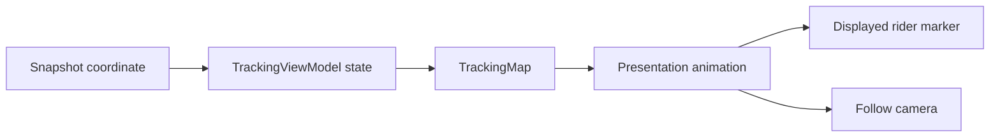

# Live Rider Movement UX

## Why animate the marker

The simulator emits a new coordinate only on each tick. Drawing each coordinate immediately makes the rider appear to jump. Interpolation creates the intermediate coordinates between the previous position and the new position, so the marker travels smoothly while the simulator remains the source of truth.

Data updates and visual animation are separate. A snapshot updates the target coordinate immediately. The map animates only the visual position from its current displayed coordinate to that target. No timing or route progression was moved into the simulator interface or repository.

## Camera follow

`TrackingMap` starts with follow mode enabled. While it is enabled, each animated rider position moves the map camera to the rider's current displayed coordinate without changing zoom. A genuine user gesture is reported by `flutter_map` as `hasGesture`; that disables follow mode so the user's map position is respected. The `Follow rider` button appears after manual movement and recenters on the current rider position while re-enabling follow mode.

Camera movement is kept simple for this phase. There is no route re-fitting on every update, no advanced camera animation, and no jitter-prone zoom or bearing changes.

## Relevant files

- `lib/features/tracking/presentation/widgets/tracking_map.dart` contains coordinate interpolation, marker animation, follow state, gesture handling, and recenter behavior.
- `lib/features/tracking/presentation/pages/tracking_page.dart` continues to pass ViewModel state into the map.
- `lib/features/tracking/presentation/view_models/tracking_view_model.dart` remains the presentation state owner.
- `test/features/tracking/presentation/widgets/tracking_map_test.dart` covers interpolation, marker inputs, route preservation, and follow/recenter behavior.

## Deferred work

This phase does not add heading, WebSockets, device geolocation, backend calls, routing APIs, notifications, production tile configuration, or a dedicated animation package. Heading is not present in `TrackingSnapshot`, so the rider icon remains upright.

## What to understand

The backend or simulator provides facts about where the rider is. The presentation layer decides how that fact looks between updates. Follow mode is also UI state, so changing data sources later should not require changing the repository contract.
