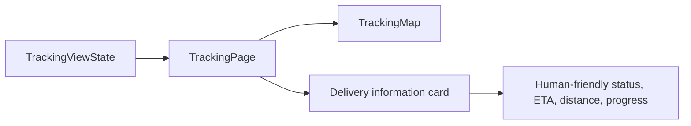

# Tracking Experience

## What this phase adds

The functional map is now presented as a friendly delivery-tracking screen. The map remains the dominant area, and a bottom information card explains the current delivery in a few quick visual groups: status, ETA, distance, rider identity, and progress.

## Presentation data

Dobz's name, the label `Your rider`, and the friendly female avatar are presentation data. They do not belong in `TrackingSnapshot`, because the current tracking source only reports delivery movement and status. The avatar uses a Flutter-native icon inside a small widget so a real rider asset can replace it later without changing the page structure.

`statusMessageFor` translates the existing `TrackingStatus` values into friendly copy such as `Dobz is on the way` and `Delivered!`. `formatEta` and `formatRemainingDistance` turn durations and meters into readable values such as `8 min` and `1.8 km away`. `deliveryProgressFor` maps the same existing statuses to a lightweight progress bar; no new domain states were introduced.

## Why the boundaries remain useful

The page receives `TrackingViewState` and renders it. It does not know whether that state came from the local simulator or a future WebSocket source. The map still owns visual movement and camera behavior, while the page owns the delivery information layout. Replacing the data source can therefore leave the customer-facing UI intact.

## Relevant files

- `lib/features/tracking/presentation/pages/tracking_page.dart` contains the polished page, rider identity, status copy, display formatting, and progress visualization.
- `lib/features/tracking/presentation/widgets/tracking_map.dart` continues to render the route, markers, smooth movement, follow mode, and recenter control.
- `test/features/tracking/presentation/pages/tracking_page_test.dart` tests status, ETA, distance, and progress presentation helpers.
- `test/widget_test.dart` checks that Dobz, the information card, progress indicator, and map remain in the composed screen.

## Intentionally unimplemented

There is no WebSocket, backend, geolocation, authentication, messaging, notifications, calling, production tile configuration, or custom image asset. The rider avatar and delivery copy are intentionally local presentation choices for the demonstration.

## What to understand

Tracking data answers what is happening. Presentation code answers how a customer should understand it quickly. Keeping those concerns separate lets the UI become warmer and clearer without changing the tracking stream or the future transport behind it.
