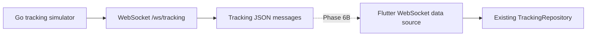

# WebSocket Contract And Go Server

Phase 6A adds the first backend boundary without connecting it to Flutter yet.

## What was built

The `backend/` folder contains a small Go server. Its `/ws/tracking` endpoint accepts a WebSocket connection, runs a deterministic route simulation, sends JSON tracking updates, sends a final `delivered` update, and then closes.

The Flutter app still uses `LocalTrackingSimulator`. The Go simulator is a separate implementation of the same conceptual tracking flow, not a replacement for the local simulator.

## Message contract

Each message contains `tripId`, `sequence`, `timestamp`, `latitude`, `longitude`, `remainingDistanceMeters`, `etaSeconds`, and `status`. Field names are stable JSON names documented in [backend/README.md](../../backend/README.md).

`sequence` lets a future client detect stale or out-of-order updates. `timestamp` records when the server produced an update using RFC3339 format. These fields become important when network delivery is not perfectly ordered or immediate.

## Separation of responsibilities

`internal/tracking/simulator.go` calculates route progress without clocks, goroutines, or sockets. `internal/tracking/handler.go` owns WebSocket upgrades and the emission interval. This separation makes simulation behavior easy to test and keeps transport details out of the tracking calculation.

Later, Flutter can add a WebSocket data source behind the existing `TrackingRepository` contract. The ViewModel and presentation layer should continue consuming tracking snapshots in the same way.

## Relevant files

- `backend/cmd/server/main.go` starts the HTTP server and handles shutdown.
- `backend/internal/tracking/message.go` defines the wire model and statuses.
- `backend/internal/tracking/simulator.go` defines deterministic route progression.
- `backend/internal/tracking/handler.go` serves `/ws/tracking`.
- `backend/internal/tracking/*_test.go` covers simulation and WebSocket emission.
- `backend/README.md` documents local usage and the JSON contract.

## Deliberately deferred

Phase 6B will connect Flutter to a WebSocket-backed source. Authentication, reconnects, stale-message policy, persistence, production deployment, and real rider location are intentionally not part of this phase.

## What I should understand

- A WebSocket keeps a two-way connection open for live messages.
- A message contract is the agreement between backend and client.
- Sequence numbers and timestamps help clients reason about message order and age.
- Simulation logic is testable independently from socket transport.
- A stable repository boundary lets Flutter change data sources without rewriting the UI.
