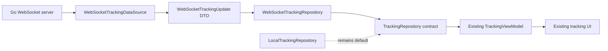

# Flutter WebSocket Data Source

Phase 6B teaches Flutter to consume the Phase 6A Go messages without changing the existing tracking screen or its default local simulator.

## What was built

The tracking data layer now has a `WebSocketTrackingDataSource` and a `WebSocketTrackingRepository`. The data source connects to an injected URL, reads text messages, validates the JSON contract, and exposes parsed wire updates. The repository maps those updates to the same `TrackingSnapshot` stream consumed by `TrackingViewModel`.

## Data layer responsibilities

The data source owns transport and decoding, so widgets do not know about sockets or JSON. The DTO represents the wire payload exactly, including `tripId` and `sequence`. It validates required fields and reports malformed JSON or unsupported statuses as stream errors instead of silently dropping them.

The existing domain model does not contain transport metadata, so `tripId` and `sequence` stay in the DTO. The timestamp becomes `updatedAt`; coordinates, distance, ETA, and status become the corresponding domain fields. The Phase 6A payload has no destination field, so the repository receives an explicit destination and defaults to the existing predefined route endpoint.

Because both repositories implement `TrackingRepository`, the ViewModel remains independent of WebSockets. The local simulator and WebSocket source can coexist, and only composition wiring needs to choose between them later. This phase leaves the local repository as the app default.

## Localhost configuration

The WebSocket URL is passed into `WebSocketTrackingDataSource` rather than hardcoded inside it. Typical development addresses are:

- macOS desktop: `ws://localhost:8080/ws/tracking`
- iOS simulator: usually `ws://localhost:8080/ws/tracking`
- Android emulator: usually `ws://10.0.2.2:8080/ws/tracking`
- physical device: use the development machine's reachable LAN address and ensure the server/firewall allows it

There is no environment-management system yet; the URL remains an explicit construction-time setting.

## Relevant files

- `lib/features/tracking/data/datasources/web_socket_tracking_data_source.dart` owns the socket stream and cleanup.
- `lib/features/tracking/data/datasources/web_socket_tracking_update.dart` validates and represents the wire message.
- `lib/features/tracking/data/repositories/web_socket_tracking_repository.dart` maps DTOs to `TrackingSnapshot`.
- `test/features/tracking/data/web_socket_tracking_test.dart` tests decoding, errors, mapping, and cleanup.
- `pubspec.yaml` adds `web_socket_channel` for the transport adapter.

## Deliberately deferred

Phase 6C will decide how an app selects a source and handles stale messages, reconnects, connection state, and user-visible failures. Authentication, persistence, production networking, and backend business logic remain deferred too.

## What I should understand

- A DTO can mirror a network contract without changing the domain model.
- The data source translates transport events into typed stream events.
- The repository preserves the ViewModel's source-independent contract.
- A malformed message should become an observable error, not disappear silently.
- The default app still uses the deterministic local simulator.
