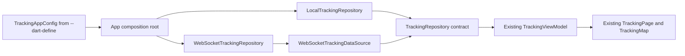

# Runtime Source Selection

Phase 6C makes the tracking source selectable without changing the tracking feature.

## What changed

`TrackingAppConfig` reads `TRACKING_SOURCE` and `TRACKING_WS_URL` in one place. The app composition root uses that configuration to create either `LocalTrackingRepository` or `WebSocketTrackingRepository`. The default is `local`.



This is dependency inversion in a small, practical form: the ViewModel depends on the stable `TrackingRepository` abstraction, while the app decides which concrete implementation to provide. The UI does not know whether updates came from a timer or a WebSocket.

## Configuration

Local mode needs no flags:

```sh
flutter run
```

WebSocket mode uses explicit compile-time values:

```sh
flutter run \\
  --dart-define=TRACKING_SOURCE=websocket \\
  --dart-define=TRACKING_WS_URL=ws://localhost:8080/ws/tracking
```

`--dart-define` values are read at compile time by `String.fromEnvironment`. Invalid source names or missing/invalid WebSocket URLs fail clearly with a configuration error rather than silently selecting local mode.

Common development URLs are:

- macOS desktop and iOS simulator: `ws://localhost:8080/ws/tracking`
- Android emulator: `ws://10.0.2.2:8080/ws/tracking`
- physical device: `ws://<development-machine-LAN-IP>:8080/ws/tracking`

No automatic network discovery is included.

## Complete Phase 6 architecture

The Go server emits the Phase 6A contract. The Flutter data source decodes it into a DTO, the WebSocket repository maps it to `TrackingSnapshot`, and the unchanged ViewModel and UI render it. The local simulator follows the same repository contract and remains the default.

## Relevant files

- `lib/app/tracking_source_config.dart` parses source configuration.
- `lib/app/tracking_composition.dart` selects the repository implementation.
- `lib/app/app.dart` provides the selected repository to the existing ViewModel.
- `lib/features/tracking/data/repositories/local_tracking_repository.dart` provides local mode.
- `lib/features/tracking/data/repositories/web_socket_tracking_repository.dart` provides WebSocket mode.
- `test/app/tracking_source_config_test.dart` covers configuration and selection.

## Deliberately deferred to Phase 7

There is no reconnect/retry logic, stale or out-of-order message handling, authentication, persistence, production environment infrastructure, automatic network discovery, or user-facing connection state yet.

## What I should understand

- Composition roots choose concrete implementations; feature logic consumes abstractions.
- The local and WebSocket repositories can coexist behind one contract.
- `--dart-define` is useful for small compile-time development switches.
- A bad WebSocket configuration should fail visibly and early.
- Changing the source does not require changing the ViewModel or tracking widgets.
